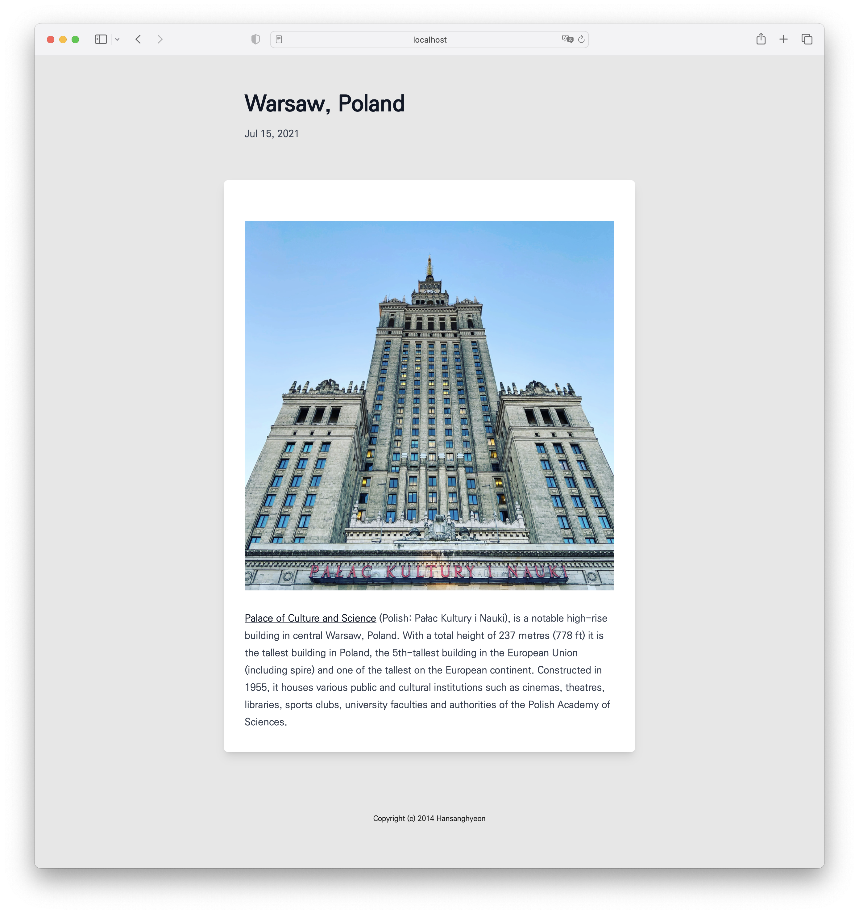
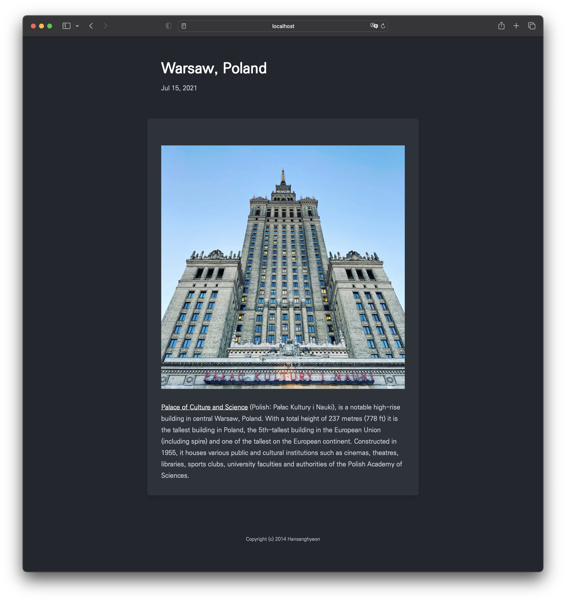

<p align="center">
  <a href="https://github.com/Hansanghyeon/console-engine#gh-light-mode-only" target="_blank">
    
  </a>
  <a href="https://github.com/Hansanghyeon/console-engine#gh-dark-mode-only" target="_blank">
    
  </a>
</p>

**매우 심플**

## development

```sh
make hugo-server
```

## install

```sh
npx degit https://github.com/Hansanghyeon/console-engine/packages/theme console-engine
```

## 테마설정 (option)

```toml
# config.toml
[markup]
  [markup.highlight]
    anchorLineNos = false
    codeFences = true
    guessSyntax = false
    hl_Lines = ''
    hl_inline = false
    lineAnchors = ''
    lineNoStart = 1
    lineNos = false
    lineNumbersInTable = true
    noClasses = true
    noHl = false
    style = 'dracula'
    tabWidth = 2
```